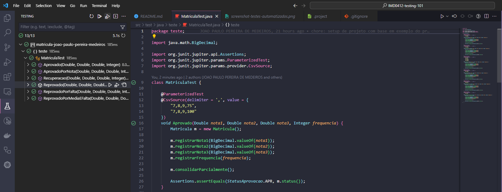

# INTRODUÇÃO AO TESTE DE SOFTWARE

## Descrição
Repositório com código versionado dos exercícios resolvidos na disciplina IMD0412 - INTRODUÇÃO AO TESTE DE SOFTWARE - T01 (2023.2).

## Desafios
### 01 - Consolidação de Matrícula Parcial

Este é o link para a [Tabela de Decisão](./docs/tabela-decisao.xlsx) usada para planejar previamente os testes automatizados.